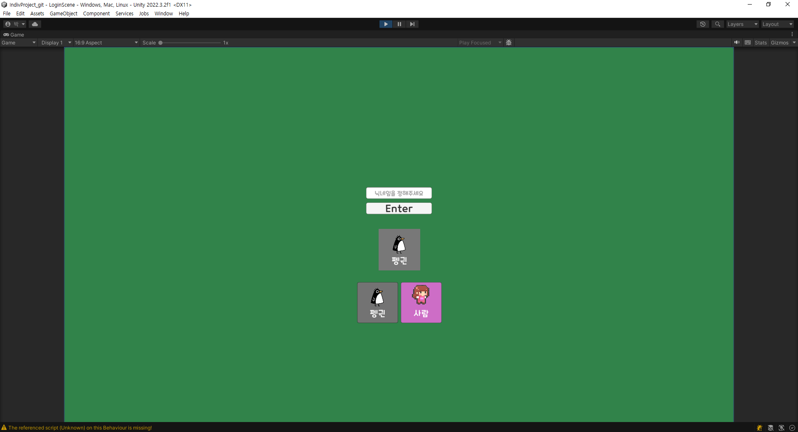
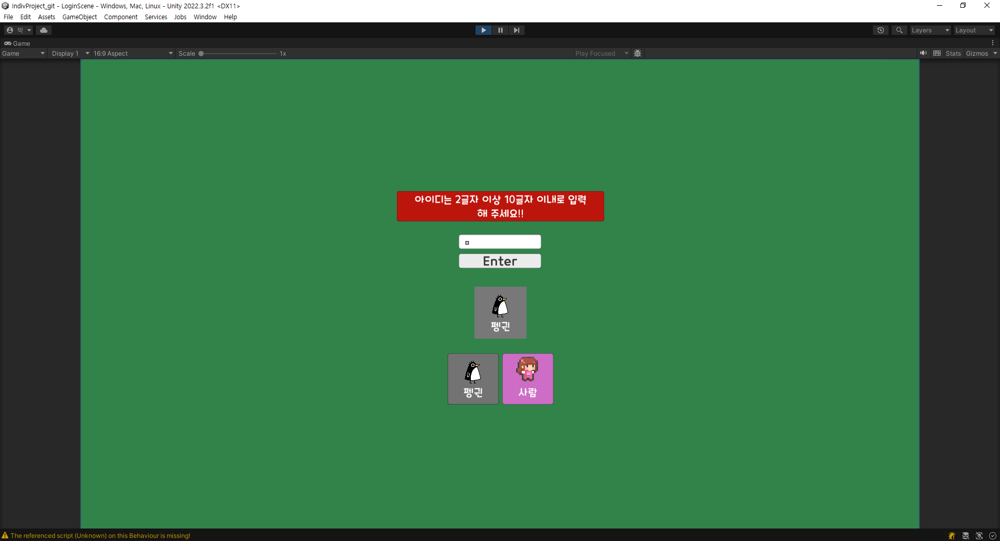

# Indiv Town 게임 프로젝트
 

## 제작: 박준형

> Unity로 개발한 게임 프로젝트 입니다.  
> 기초를 다지기 위함이며 어떻게 동작하는지 감을 잡기 위해 만든 프로젝트입니다.  
> 2D 프로젝트이며 간단한 움직임 및 캐릭터 변경만 가능합니다.

 

##  기술 스택

  

## 주요 기능

* Load Scene

    * 닉네임 설정
    * 캐릭터 선택

* Game Scene

    * 선택한 캐릭터 등장
    * 닉네임 머리위에 출력
    * wasd로 좌우 상하 움직임 가능
    * 펭귄은 space키 입력시 점프 애니메이션 연출
    * 현재 시간 출력

## 기능 세부 설명

* 로그인 화면 

    * 닉네임 설정은 2글자 이상 10글자 이하로 설정 가능
    * 캐릭터는 펭귄과 사람 둘 로 나뉨
    * 기본 캐릭터는 펭귄이며 사람 선택시 변경 가능
    
* 게임 화면

    * 설정된 닉네임과 캐릭터로 진행
    * wasd로 움직일 수 있으며 마우스 포인터에 따라 캐릭터 방향 전환
    * 좌측 상단에 현재시간 출력

## 구현한 기능 (GIF파일 크기 수정으로 인해 화질이 좋지 않습니다)

### LoadScene

 
 * 게임 시작 화면
 * 기본 캐릭은 펭귄으로 선택되어 있음 

  

 __로그인 오류__ 

 * 2글자 미만 또는 10글자 초과시 위 경고문구 등장
 * 3초 후 경고문구 사라짐 

 

__캐릭터 선택__  

 * 펭귄 또는 사람을 선택할 수 있음
 * 선택 한 캐릭터 이미지를 출력

 

__닉네임 설정__  

  

 * 캐릭터 선택 후 닉네임 설정후 게임 입장 시 해당 캐릭터와 닉네임으로 진행

 

### GameScene

 

__캐릭터 움직임__

  

 

  

* wasd로 움직임
* 대각선 이동 속도 동일
* 바라보는 방향으로 캐릭터 전환
* 대기모션과 움직임 모션 애니메이션 추가
* 펭귄은 점프시 애니메이션 추가
* 좌측 상단 현재 시간 표시

 

__구조물 충돌__  

  

* 외부벽 및 구조물 충돌 구현

 

## 프로젝트 시 일어난 문제와 해결  

### 프로젝트

__문제__ :  폰트의 흐릿함

__구현하기로 한 내용__ : 게임 내에 필요한 텍스트들을 출력하기 위해 TMP를 사용

__문제가 발생한 상황__ : 그냥 Scene으로 볼때는 문제없으나 Game화면에서는 폰트가 흐릿하게 나타남

__문제 해결을 위해 노력한 것__ : 폰트 변경 , Dynamic Pixels per Unit 조정 등 노력함

__결과__ : WorldSpace로 꺼낸 후 크기 조절 및 폰트 크기를 좀 더 키워줌 > 해결됨

 

__문제 2__ : LoadScene에서 GameScene로 userId 전달 시 NullReference 오류

__구현하기로 한 내용__ : InputFiled에 Text입력시 GameScene의 NameTag에 전달

__문제가 발생한 상황__ : NullReference 오류를 범함

__문제 해결을 위해 노력한 것__ : GameManager 싱글톤을 이용함

__결과__ : 싱글톤에 대한 이해도가 부족하였고, 이를 해결하기 위해 자료 탐색 및 해결 완료

__기록__ : [공부했던 내용을 기록한 블로그](https://dochistory.tistory.com/95)

## 프로젝트 소감

아직 유니티에 입문이기도 하고 모르는 내용이 너무 많았습니다. 감을 잡는게 무엇보다 중요한데 아직은 구동은 하지만  
뭔가 아쉬운부분이 있고 내가 하고있는게 맞나 싶은 생각도 드는 단계입니다.  
자기 객관화를 잘 하여 모르는 부분은 확실하게 넘어가고 계속 구현해서 실력을 늘려야 할 것 같습니다.
